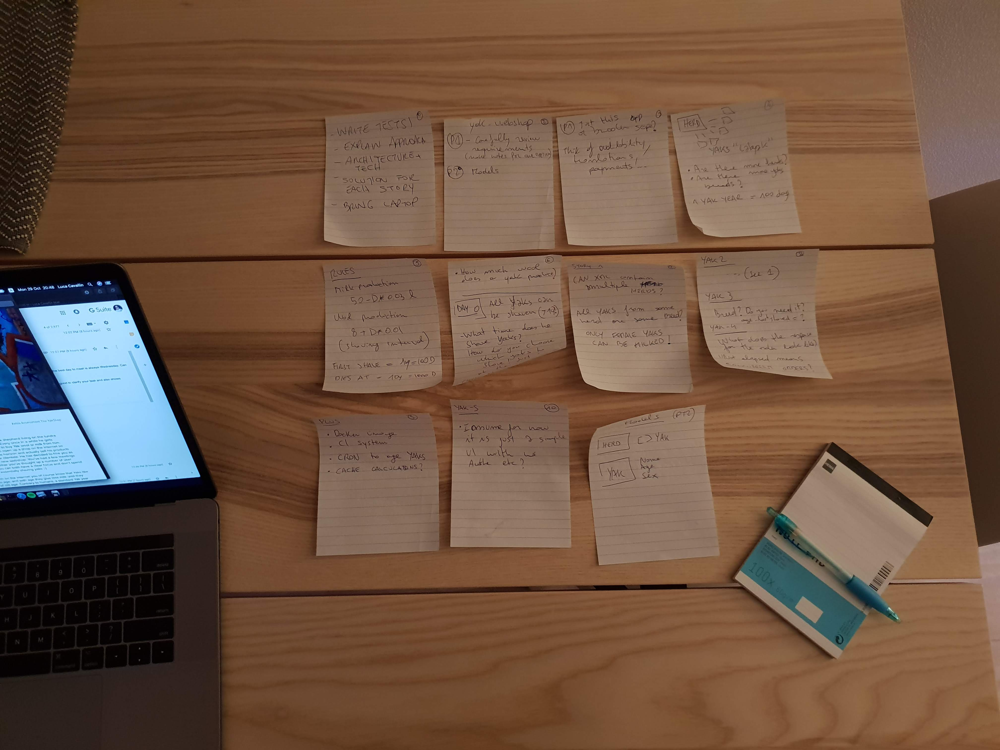

# Yak Webshop
[](https://www.codacy.com?utm_source=github.com&amp;utm_medium=referral&amp;utm_content=lucavallin/yak-webshop&amp;utm_campaign=Badge_Grade)
[](https://travis-ci.com/lucavallin/yak-webshop)
[](https://codecov.io/gh/lucavallin/yak-webshop)

Helping a yak shepherd living on the tundra herding a group of Yaks.
The full assignment can be found in docs/assignment.pdf and a dummy XML file has been included in data/herd.xml.
There is a collection of Postman endpoints at docs/yak-webshop.postman_collection.json.
This repo is available as private in Gitlab and Github.

See the badges included for CI status and testing coverage.

The live application is running at http://yak-webshop.herokuapp.com/yak-webshop (API only).

## Overview
I have decided to build a CLI app because I like the organized structure it creates and it makes it easy to add new features.
I choose Go for the purpose, since I have been working more with it lately and creating APIs with it is quite fast. Also, there is a lot
of serialization/unserialization going on and the default marshalling libraries do the job neatly.

I have used a cmd/pkg structure for the directories, I have picked it up some time ago after reading one of those "best-practices" articles :)
API routing is handled by Gin, chosen because of its straight-forward APIs and for being the most used web framework in the Go ecosystem (https://www.jetbrains.com/research/devecosystem-2018/go/). Also, I wanted to try it out.

Persistence is done with files, a horrible solution for any real use, but ok for the purpose and to avoid spending more time on unneccessary tweaks (or was it the goal?).
If the Shepherd has some more money to spend, I would move all of this to a regular database (probably MongoDB, which served well in similar
situations in the past).

The frontend in the /ui directory. I was running our of time at this point, so there's not much to see. I've layed down the structure (some) of the app
but couldn't write tests or finish the story, I hope it gives an indication however.
HerdUpload is a "complete" component, however it could be split into smaller pieces.

## How to run

```
# Install dependencies
dep ensure

# The query command
go run yak-webshop.go query -f=./data/herd.xml -d=13

# The API server
PORT=80 go run yak-webshop.go serve

# Linting
make lint

# Tests
make test

# For the ui, run npm install and see ui/package.json
```

## ENV variables
- Gin router requires GIN_MODE=release when running in production
- PORT defines on which port the http should be listening. Example: PORT=80

## Stories
### First steps
I have started the assignment by reading through the requirements, making sketches to lay down the basic blocks of my application.
I had doubts on a few points and decided to contact the Shepherd for more information.



### YAK-1
I setup the application structure, in particular creating the query command.
Wrote down the business logic and created test to confirm it (helped spot a bug I had in the algorithm).
The herd and the yak are simple data structures. The herd contains a reference to multiple yaks that are then used to calculate stock.
I still have a small doubt about this one, see the comments in pkg/herd/yak.go file.

```
type Herd struct {
	Yaks []*Yak `xml:"labyak" json:"herd"`
}

type Yak struct {
	Name string `xml:"name,attr" json:"name"`
	Sex string `xml:"sex,attr" json:"-"`
	// The age comes in years and needs to be converted at runtime
	Age float64 `xml:"age,attr" json:"age"`
	AgeLastShaved float64 `xml:"-" json:"age-last-shaved"`
}
```

After doing this I realised it would be handy to have a Yak interface which can be implemented by specific breeds, in our case the Labyak.
It's currently not in the code but having more time I would go for that approach, so the formulas behind each breed is separated (more on this in the improvements section).

```
type Yak interface {
	Milk() float64
	Shave() int
	IncreaseAge(daysOlder int)
}
```

### YAK-2
Having the Herd and Yak in place, the next step was creating some APIs.
I have created a new Serve command, which creates a new application and starts the server.
Initially it was just routes registered in the command itself, then realised that it would make it a lot easier to have the concept
of "App" which registers the endpoints passing the needed dependencies (herd repository) and that works as a primitive
service container too.
This helps making testing easier too, as I can start a new app from anywhere.

The idea of a herd repository came up because of the file-based storage I am using. That's something I would like to get rid of quickly
and separating the logic from the actual implementation will make it much easier to replace the current storage with for example an
in-memory database like https://github.com/hashicorp/go-memdb or MongoDB using https://github.com/go-bongo/bongo. 

### YAK-3
This story was very similar to the first, except now I needed a Stock object to return to the user and more interestingly,
a way to "age" the Yaks to provide an overview of the herd at X days.
I decided for this approach:

```
// Age makes the herd older to provide an overview at X days
func (h Herd) Age(elapsedDays int) {
	for day := 0; day < elapsedDays; day++ {
		for _, yak := range h.Yaks {
			yak.Shave()
			yak.IncreaseAge(1)
		}
	}
}
```

Here I am calling yak.Shave() because it is the easiest way to get the possible AgeLastShave from the yaks.

### YAK-4
I needed new models for the order. I decided to let the customer be a string, but I would rather have a Customer object in the future,
so I can store more information about the person who placed the order.

For the purpose I am retrieving the stock at X days and comparing the availability with that requested and sending a response as specified
in the requirements.

### YAK-5
I chose React for the task since it's the library I am more comfortable with.
react-boilerplate (https://github.com/react-boilerplate/react-boilerplate) is my favourite starting point because of the
enterprise-ready architecture with redux, redux-saga, the container/component pattern and a bunch of other features.
I think it should divide containers from views as well, and segregate api calls in a "apiService" package.

However, given the small nature of this app, Next.js might be a better choice, a full framework would save me quite some time 
from setting up the structure I need, plus the advantage of a third party keeping it updated for me.

### YAK-6
I wanted to make the application deployment ready, therefore I included:
- .travis.yml for CI builds
- Dockerfile
- Procfile to run on Heroku
- Makefile to keep the CI configuration clean
- Coverage reports
- Codacy report for code quality

These benefits are not applicable to the frontend part.

## Improvements

- Use an application framework and a injection container for the repos
- Use a real database
- In real life, use a cron job to update the herd/stock everyday
- Yak milking and shaving logic would better be moved to a LabYak strategy that handles the checks and formulas, these
currently live in the model itself, making it harder to read and tying the logic to the LabYak breed (maybe also use a configuration based approach for formulas?).
For the same reason, it would also be better to detach the Yak "interface" from our "Labyak"
- Include breed in Yak object
- Everything should be converted to JSON so XML only exists at the load request
- Integration tests for commands in cmd package
- HTTP tests can be improved
- Currently both skins and wool is being used, I suggest calling everything "wool"
- Order has customer as a string property. Use a Customer object instead.
- Find a better way to set float precision for JSON responses
- Add tests for marshaling/unmarshalling from and to json/xml for all involved structs
- Benchmarking tests, to see how efficient the milking and shaving calculations are (caching/memoization and keeping track of eligible yaks would make it faster probably)
- Named return values could make code easier to navigate via inspector
- Command to generate random XMLs for testing